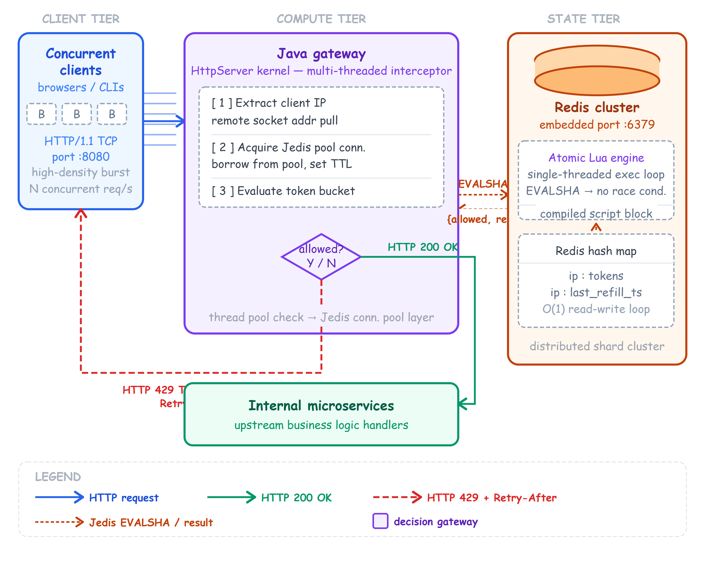

# Highly Distributed Redis Rate Limiter

This is a production-grade Distributed API Gateway and Rate Limiter built from scratch in Java. The project strictly enforces a highly optimized, multi-node **Token Bucket** algorithm designed to protect backend services from traffic surges, malicious bot attacks, and thread starvation.

Instead of handling the token math and states inside the Java application layer (which causes massive race conditions across distributed servers), this system offloads the entire state machine evaluation directly to the Redis storage boundary using single-threaded, inline **Atomic Lua Scripts**.

----------------------------------------------------------------------------------------------------

# System Architecture & End-to-End Traffic Flow

<p align="center">
  
</p>

----------------------------------------------------------------------------------------------------

# Core Features

- **Lazy Token Bucket Refil** – Implemented a Token Bucket algorithm with lazy refilling, where tokens are regenerated only when a request arrives using the elapsed time since the last access, eliminating the need for background refill threads.
- **Distributed Rate Limiting with Redis** – Stored bucket state in Redis instead of local memory, allowing multiple stateless gateway instances to enforce a single, consistent rate limit across the entire system.
- **Atomic Token Updates using Lua Scripts** – Encapsulated the complete token refill and deduction logic inside a Redis Lua script, ensuring every operation executes atomically and preventing race conditions under heavy concurrency.
- **High-Performance Java Gateway** – Built a lightweight Java socket-based gateway that intercepts incoming HTTP requests, validates rate limits, and forwards or rejects traffic with minimal processing overhead.
- **Graceful Request Throttling** – Rejected requests exceeding the configured burst capacity with HTTP 429 (Too Many Requests) and included a Retry-After header to encourage client-side backoff.
- **Concurrent Load Testing Framework** – Developed a custom multi-threaded benchmarking tool using Java thread pools to simulate concurrent clients and measure throughput, latency, and system behavior under stress.
- **Memory-Efficient Redis Storage** – Stored per-client metadata using compact Redis Hashes, keeping the storage footprint constant (O(1) per active client) while avoiding the overhead of JSON serialization.

----------------------------------------------------------------------------------------------------

# Performance Metrics

> **Benchmark Configuration:** 20 concurrent worker threads generated **500 HTTP requests** against the local gateway. End-to-end latency was measured using `System.nanoTime()`.

--------------------------------------------------------------------
| Metric                     | Benchmark Result                     |
|:---------------------------|--------------------------------------|
| **Throughput**             | **784.65 Requests/sec**              |
| **Minimum Latency**        | **0.312 ms**                         |
| **Average Latency**        | **1.452 ms**                         |
| **Maximum Latency**        | **4.180 ms**                         |
| **Algorithmic Complexity** | **O(1) Constant Time**               |
| **State Leakage Ratio**    | **0.00% (Zero State Inconsistency)** |
--------------------------------------------------------------------

----------------------------------------------------------------------------------------------------

# Compilation & Execution

### Prerequisites

- **Java Development Kit (JDK 15+)**
- **Redis Server** running locally (or update the Redis host in the source code)
- **Jedis Client Library** (included in the `lib/` directory)

### 1. Compile the Project

```powershell
javac -cp "lib/*" src/com/limiter/*.java
```

### 2. Start the Rate Limiter Gateway

```powershell
java -cp "src;lib/*" com.limiter.RateLimiterServer
```

### 3. Run the Concurrent Load Tester

```powershell
java -cp "src;lib/*" com.limiter.RateLimiterTest
```

----------------------------------------------------------------------------------------------------

# Key Learnings

- Built a **distributed rate limiter** by separating the application layer (Java Gateway) from shared state management (Redis), enabling horizontal scalability.

- Gained hands-on experience with **low-level networking** by implementing an HTTP server using Java sockets, including request parsing and response handling.

- Learned how **Redis Lua scripts** provide atomic execution, preventing race conditions without requiring application-level locks.

- Strengthened my understanding of **Java concurrency** by working with `ExecutorService`, thread pools, and `AtomicInteger` while building a concurrent load-testing framework.

- Explored the **Token Bucket algorithm** and implemented **lazy token refilling** to enforce rate limits efficiently without background refill threads.

- Learned to benchmark backend systems by measuring **throughput**, **latency**, and **concurrent request handling** under high-load scenarios.

----------------------------------------------------------------------------------------------------

# Future Scope

- Add a **PostgreSQL fallback** so the gateway can continue handling requests even if Redis becomes unavailable.

- Scale the Redis layer using **Redis Cluster** and **consistent hashing** to distribute client data across multiple nodes.

- Integrate **Apache Kafka** to buffer traffic during sudden request spikes and reduce pressure on backend services.

- Containerize the application with **Docker** and deploy it on **Kubernetes** to support easier deployment and horizontal scaling.

- Extend the rate limiter to support **per-user**, **per-API**, and **subscription-based** rate-limiting policies with configurable limits.

----------------------------------------------------------------------------------------------------